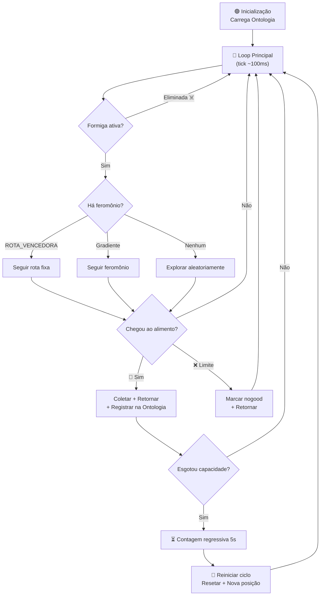

# Diagrama de Sequência — Simulação do Formigueiro Inteligente

## Visão Geral

O diagrama abaixo mostra as interações entre os participantes do sistema durante um ciclo completo de simulação, desde a **inicialização via ontologia** até o **forrageamento**, **predação** e **reinício automático**.

### Participantes

| Participante | Classe / Arquivo | Papel |
|---|---|---|
| **Executor** | `executor_formigueiroFeronomio.py` | Orquestrador principal (loop `asyncio`) |
| **Ontologia** | `OntologyManager` → `formigueiro.ttl` | Fonte única de verdade (parâmetros, agentes, eventos) |
| **Formiga** | `FormigaFeronomio` (`base_formigaFeronomio.py`) | Agente autônomo — `asyncio.Task` individual |
| **Ambiente** | `AmbienteFormigueiro` (`ambiente_formigueiro.py`) | Mapa compartilhado de feromônios |
| **Interface** | `InterfaceFormigueiro` | Canvas Tkinter para visualização |

---

## Diagrama de Sequência

```mermaid
sequenceDiagram
    autonumber

    participant Exec as Executor<br/>(main loop)
    participant Onto as OntologyManager<br/>(formigueiro.ttl)
    participant Amb as AmbienteFormigueiro<br/>(feromônio)
    participant F as FormigaFeronomio<br/>(×20 Tasks)
    participant UI as InterfaceFormigueiro<br/>(Tkinter)

    %% ═══════════════════════════════════════
    %% FASE 1 — INICIALIZAÇÃO
    %% ═══════════════════════════════════════
    rect rgb(45, 80, 56)
        Note over Exec,UI: FASE 1 — Inicialização via Ontologia
        Exec->>Onto: OntologyManager()
        Onto-->>Exec: grafo RDF carregado

        Exec->>Onto: get_populacao_total()
        Onto-->>Exec: 20

        Exec->>Onto: get_capacidade_alimento()
        Onto-->>Exec: 4

        Exec->>Onto: get_intervalo_tamandua()
        Onto-->>Exec: 5s

        Exec->>Onto: get_formigas()
        Onto-->>Exec: [{Formiga01..Formiga20}]

        Exec->>Amb: limite_alimento = 4

        loop Para cada formiga (F1..F20)
            Exec->>F: FormigaFeronomio(nome, vizinhos)
            F->>Onto: get_limite_passos(nome_onto)
            Onto-->>F: 20
            F->>Onto: get_ignora_limite_energia(nome_onto)
            Onto-->>F: true
        end

        Exec->>Exec: gerar_alimento() → posição aleatória
        Exec->>Exec: gerar_tamandua() → posição aleatória
        Exec->>Onto: atualizar_posicao_tamandua(pos)

        Exec->>F: configurar_rede(formigas)<br/>inbox ↔ network
        Exec->>UI: InterfaceFormigueiro(root, formigas, ...)

        Exec->>F: asyncio.create_task(f.agir())<br/>×20 tarefas paralelas
    end

    %% ═══════════════════════════════════════
    %% FASE 2 — CICLO PRINCIPAL
    %% ═══════════════════════════════════════
    rect rgb(30, 60, 100)
        Note over Exec,UI: FASE 2 — Ciclo Principal (loop assíncrono)

        loop A cada tick (~100ms)
            Exec->>UI: root.update() + desenhar()
            UI-->>Exec: canvas atualizado

            %% Verificação do Tamanduá
            alt Tempo do tamanduá expirou (5s)
                Exec->>Exec: gerar_tamandua(nova_pos)
                Exec->>Onto: atualizar_posicao_tamandua(nova_pos)
                Exec->>UI: interface.tamandua = nova_pos
            end

            %% Verificação de Predação
            loop Para cada formiga ativa
                alt formiga.posicao == tamandua_pos
                    Exec->>F: f.eliminada = True
                    Exec->>Onto: incrementar_predacao()
                    Exec->>UI: posicoes_eliminacao.append(pos)
                    Note right of F: ☠️ Formiga eliminada
                end
            end
        end
    end

    %% ═══════════════════════════════════════
    %% FASE 2b — COMPORTAMENTO DA FORMIGA
    %% ═══════════════════════════════════════
    rect rgb(80, 50, 20)
        Note over F,Amb: FASE 2b — Ciclo de Vida da Formiga (agir)

        F->>F: agir() — loop assíncrono

        alt Retornando ao formigueiro
            F->>F: caminho_retorno.pop()
            F->>Onto: atualizar_posicao_formiga(pos)

        else ROTA_VENCEDORA existe e formiga está nela
            F->>F: seguir_rota_fixa()
            F->>Amb: registrar_coleta()
            F->>Onto: incrementar_coleta()
            F->>Onto: registrar_rota(caminho, sucesso=True)
            Note right of F: 🍎 Coleta via rota vencedora

        else Feromônio existe no ambiente
            F->>Amb: valor_feromonio(pos)
            Amb-->>F: intensidade
            F->>F: seguir_rota_sucesso()<br/>gradiente de feromônio
            alt Chegou ao alimento
                F->>Amb: registrar_coleta()
                F->>Amb: depositar_trilha(caminho, 2.0)
                F->>Amb: fixar_trilha(caminho)
                F->>Onto: incrementar_coleta()
                F->>Onto: registrar_rota(caminho, sucesso=True)
                F->>Onto: registrar_feromonio(pos, next, "positivo")
                Note right of F: 🍎 Coleta via gradiente
            end

        else Exploração aleatória
            F->>F: explorar()
            F->>Amb: valor_feromonio(vizinhos)
            F->>F: escolher melhor vizinho (75% gradiente / 25% aleatório)
            F->>Onto: atualizar_posicao_formiga(nova_pos)

            alt Encontrou o alimento
                F->>Amb: registrar_coleta()
                F->>Amb: depositar_trilha(rota, 2.5)
                F->>Amb: fixar_trilha(rota)
                F->>Onto: incrementar_coleta()
                F->>Onto: registrar_rota(caminho, sucesso=True)
                F->>Onto: registrar_feromonio(segmentos, "positivo")
                Note right of F: 🏆 Primeira a achar = ROTA_VENCEDORA

            else Limite de passos excedido
                F->>Amb: depositar_trilha(rota, -0.8)
                F->>Onto: registrar_rota(caminho, sucesso=False)
                F->>Onto: registrar_feromonio(pos, null, "nogood")
                F->>F: retornar_ao_formigueiro()
                Note right of F: ❌ Rota marcada como falha (nogood)
            end
        end

        %% Evaporação periódica
        alt A cada 20 ticks
            F->>Amb: evaporar()
            Note right of Amb: Feromônio decai 2% por ciclo<br/>(exceto trilha fixa)
        end
    end

    %% ═══════════════════════════════════════
    %% FASE 3 — ALIMENTO ESGOTADO / REINÍCIO
    %% ═══════════════════════════════════════
    rect rgb(100, 30, 30)
        Note over Exec,UI: FASE 3 — Alimento Esgotado → Reinício

        Exec->>Exec: total_coletado >= capacidade (4)?
        Exec->>F: task.cancel() — todas as tarefas

        loop Contagem regressiva (5s)
            Exec->>UI: "Reiniciando em {n}s..."
        end

        Exec->>Exec: gerar_alimento() — nova posição
        Exec->>Exec: gerar_tamandua() — nova posição
        Exec->>Onto: atualizar_posicao_tamandua(nova_pos)
        Exec->>Onto: resetar_contadores()

        Exec->>F: resetar_estado_formigas()<br/>posicao=(0,0), inbox=Queue(), eliminada=False
        Exec->>F: configurar_rede(formigas)
        Exec->>F: asyncio.create_task(f.agir()) ×20

        Note over Exec,UI: Novo ciclo inicia automaticamente
    end
```

---

## Legenda de Símbolos

| Símbolo | Significado |
|:---:|---|
| 🏆 | Primeira formiga a encontrar o alimento — define `ROTA_VENCEDORA` global |
| 🍎 | Coleta de alimento bem-sucedida |
| ☠️ | Formiga eliminada pelo tamanduá (predação) |
| ❌ | Rota marcada como falha (feromônio negativo / *nogood*) |

## Fluxo Resumido

